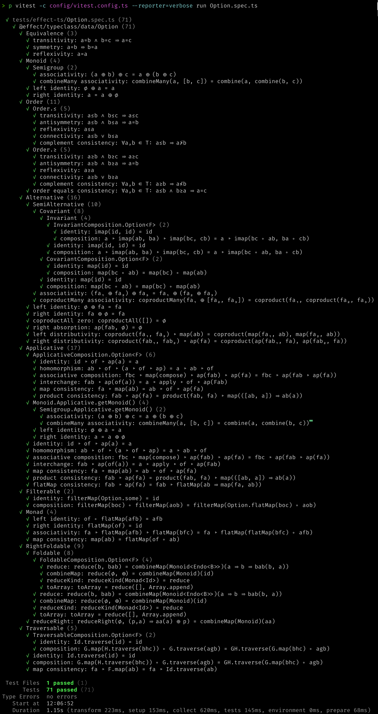
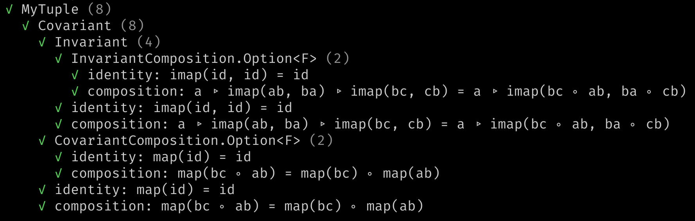

<h1 align='center' style='border: 0px !important'>⚖ effect-ts-laws</h1>

<h3 align='center' style='border: 0px !important'>
  Law Testing for
  <code style='color:#555'>effect-ts</code>
  Code
</h3>

A library for law testing. Test
[@effect/typeclass](https://www.npmjs.com/package/@effect/typeclass) and
[schema](https://effect.website/docs/schema/introduction/) laws using
[fast-check](https://github.com/dubzzz/fast-check). The typeclass laws implemented are
[listed here](https://middle-ages.github.io/effect-ts-laws-docs/catalog-of-laws.html).

Read on for the project introduction or jump to:

1. [User guide](docs/user-guide.md)
2. [API docs](https://middle-ages.github.io/effect-ts-laws-docs/).

---

1. [About](#about)
   1. [Synopsis](#synopsis)
      1. [Testing Typeclass Laws on `Option<A>`](#testing-typeclass-laws-on-optiona)
      2. [Testing Typeclass Laws on a New Datatype](#testing-typeclass-laws-on-a-new-datatype)
   2. [Overview](#overview)
2. [Project](#project)
   1. [Play](#play)
   2. [Status](#status)
   3. [More Information](#more-information)
   4. [Roadmap](#roadmap)
3. [See Also](#see-also)
   1. [Based On](#based-on)

## About

### Synopsis

#### Testing Typeclass Laws on `Option<A>`

<details>
<summary style='background:#f0f6ff;color:blue;cursor:pointer'>
Example 1: testing the `Option` datatype.
<span style='float: right'>👈 <i>click</i></span></summary>
<br/>

[testTypeClassLaws](https://middle-ages.github.io/effect-ts-laws-docs/functions/vitest.testTypeclassLaws.html)
will find the correct typeclass laws and test them. To define the tests required
for the `Option` datatype, for example, we need to:

1. Provide a function to build an `Equivalence<Option<A>>` from an
   `Equivalence<A>`.
    * Thankfully, `effect-ts` has such a function in the `Option`
      module called
      [getEquivalence](https://github.com/Effect-TS/effect/blob/main/packages/effect/src/Option.ts#L1059).
2. Provide the same for _arbitraries_.
    * `effect-ts-laws` exports an [option](src/arbitrary/README.md)
      function. It takes an `Arbitrary<A>` and return an `Arbitrary<Option<A>>`.
3. List all instances for the datatype by their typeclass name.
   * Note in the code below some instances, for example `Order`, are built from
     the instance of the underlying type. The `effect-ts-laws` export
     [monoOrder](https://middle-ages.github.io/effect-ts-laws-docs/functions/laws.monoOrder.html)
     provides this for the `Order` typeclass.

The `Option` typeclass law test:

```ts
import {
  Alternative,
  Applicative,
  Foldable,
  getOptionalMonoid,
  Monad,
  Traversable
} from '@effect/typeclass/data/Option'
import {Option as OP} from 'effect'
import {monoEquivalence, monoOrder, monoSemigroup, option} from 'effect-ts-laws'
import {testTypeclassLaws} from 'effect-ts-laws/vitest'
import {OptionTypeLambda} from 'effect/Option'

describe('@effect/typeclass/data/Option', () => {
  testTypeclassLaws<OptionTypeLambda>({
    getEquivalence: OP.getEquivalence,
    getArbitrary: option,
  })({
    Alternative,
    Applicative,
    Equivalence: OP.getEquivalence(monoEquivalence),
    Foldable,
    Monad,
    Monoid: getOptionalMonoid(monoSemigroup),
    Order: OP.getOrder(monoOrder),
    Traversable,
  })
})
```

What do we get in return to our investment in the three steps above and in
the added maintenance costs of this tiny, easy to maintain test?

Good coverage for a freight train full of fault models. _Vitest reporter_ showing
test results for the _seventy one_ typeclass laws relevant to the effect-ts `Option`
datatype as defined in the test above:

<a href="./docs/resources/screenshots/synopsis-option.png"></a>
</details>

---

#### Testing Typeclass Laws on a New Datatype

<details>
<summary style='background:#f0f6ff;color:blue;cursor:pointer'>
Example 2: Testing a custom <i>unary tuple</i>.
<span style='float: right'>👈 <i>click</i></span></summary>
<br/>

You wrote a new datatype: `MyTuple`, and an instance of the effect-ts
`Covariant` typeclass. Lets test it for free:

```ts
import {Covariant as CO} from '@effect/typeclass'
import {Array as AR} from 'effect'
import {dual} from 'effect/Function'
import {TypeLambda} from 'effect/HKT'
import fc from 'fast-check'
import {testTypeclassLaws} from 'effect-ts-laws/vitest'

describe('MyTuple', () => {
  type MyTuple<A> = [A]

  interface MyTupleTypeLambda extends TypeLambda {
    readonly type: MyTuple<this['Target']>
  }

  const map: CO.Covariant<MyTupleTypeLambda>['map'] = dual(
    2,
    <A, B>([a]: MyTuple<A>, ab: (a: A) => B): MyTuple<B> => [ab(a)],
  )
  const Covariant: CO.Covariant<MyTupleTypeLambda> = {
    imap: CO.imap<MyTupleTypeLambda>(map),
    map,
  }

  testTypeclassLaws<MyTupleTypeLambda>({
    getEquivalence: AR.getEquivalence,
    getArbitrary: fc.tuple,
  })({Covariant})
})
```

`fast-check` will try to find a counterexample that breaks the laws. Because
it is quite impossible to find one in this case you should see:

<a href="./docs/resources/screenshots/synopsis-tuple.png"></a>

Above you see that _eight_ typeclass laws that were tested:

1. **Covariant** <u>identity</u> and <u>composition</u> laws. `count = 2`
    1. Because **Covariant** _extends_ **Invariant**, the  typeclass
       laws of <u>identity</u> and <u>composition</u> of this typeclass are tested.
      `count = 2 + 2`
        1. effect-ts lets you _compose_ a pair of **Invariants** into a new
           **Invariant**.  There are fault models that will only be covered if we
           test such composed instances. To cover these fault models, the
           instance under test is composed with the `Option` Invariant instance
           and run through the <u>identity</u> and <u>composition</u> laws.
           `count = 2 + 2 + 2`
    2. effect-ts lets you compose **Covariants** as well. The instance under
       test is composed with the `Option` Covariant instance and run through
       the <u>identity</u> and <u>composition</u> laws. `count = 2 + 2 + 2 + 2`

</details>

### Overview

_Law testing_ is [property
testing](https://zio.dev/reference/test/property-testing), except the properties
are well known _laws_. Besides being famous, the laws included here were chosen
because they _catch bugs efficiently_ . If you can identify the laws that should
govern your code, then `effect-ts-laws` will help you test them.

For example when implementing instances of effect-ts _typeclasses_ for your
datatype, they must be bound by their
[typeclass laws](https://middle-ages.github.io/effect-ts-laws-docs/catalog-of-laws.html).
`effect-ts-laws` exports ready-made tests for these, and with very little work
they can be added to your test suite to reduce the risk your customizations are
unlawful.

**Features**:

* Laws
  * Typeclass laws for `effect-ts` typeclasses
  * [Encode/decode laws](http://middle-ages.github.io/effect-ts-laws-docs/functions/laws.schemaLaws.html) and Equivalence laws for
    [effect/Schema](https://effect-ts.github.io/effect/effect/Schema.ts.html)
  * `effect-ts` datatype typeclass law tests to serve as self-test, demo, and
    to help [this remarkable project](https://effect.website). See
    [status](#status) for details on what is ready.
* Law testing infrastructure
  * `fast-check` arbitraries for
    [effect datatypes](./src/arbitrary/README.md)
  * [typeclass instances](https://github.com/middle-ages/effect-ts-laws/blob/main/src/arbitrary/instances.ts) and
    [typeclass law tests](https://github.com/middle-ages/effect-ts-laws/blob/main/tests/fast-check.spec.ts)
    for the `fast-check` _Arbitrary_ type.
* _Randomness_. Uses `fast-check` property testing. For
  _parameterized type_ typeclass laws, all functions are randomly generated as
  well.
* Minimal work to test instances for your own datatype: it can all be
  done with single function that takes the instances under test and
  a pair of functions: `getEquivalence` and `getArbitrary`.
  * Meaningful test coverage improvement for the price of writing two functions.
    You probably have them somewhere already.

## Project

### Play

You can run the project tests online at any of these online sandboxes by opening
a terminal and calling `pnpm install && pnpm test-run`. `pnpm coverage` will give
you the always 100% coverage report.

1. [StackBlitz](https://stackblitz.com/~/github.com/middle-ages/effect-ts-laws).
   Note _coverage_ does not work on StackBlitz.
2. [replit](https://replit.com/@middle-ages/effect-ts-laws) requires you fork
   the repository first by clicking the green `Fork` button.
3. [CodeSandbox](https://codesandbox.io/p/github/middle-ages/effect-ts-laws/main?import=true).

The full self-test suite will run in less than 10 seconds on an average desktop,
but will take a minute or two to run on the free tiers of the services above.

### Status

[This matrix shows](https://middle-ages.github.io/effect-ts-laws-docs/media/status.html)
_data-types_ (in columns) vs. _typeclass law tests_ (in rows). Each intersection
of datatype and typeclass can be either: **ready** (✅), **not ready** (❌), or
**not relevant** (☐).

Click a _datatype_ (in column header) to open its source code in the `effect-ts`
project. Click a _typeclass name_ (in row header) to open its laws as defined in
`effect-ts-laws`.

### More Information

* [User guide](docs/user-guide.md).
* [API documentation](https://middle-ages.github.io/effect-ts-laws-docs/).
* [Catalog of laws](https://middle-ages.github.io/effect-ts-laws-docs/catalog-of-laws.html).
* [Status of effect.ts datatype tests](https://middle-ages.github.io/effect-ts-laws-docs/media/status.html).
* `README` for the [arbitraries](src/arbitrary/README.md) exported.
* `README` for the [law](src/law/README.md) module.
* `README` at [the laws for typeclasses](src/laws/typeclass/concrete/README.md) on concrete types.
* `README` at [the laws for typeclasses](src/laws/typeclass/parameterized/README.md) on parameterized types.

### Roadmap

* Laws
  * [ ] Sink Contravariant laws.
  * [ ] More datatypes.
  * [ ] Relational laws.
  * [ ] Functional laws.
* Harness
  * [ ] Pretty print counterexamples. Allow using exception throwing test code+
        validation code returning Either instead of boolean for Law.predicate.
  * [ ] API should let you use any catalog.
* Composition
  * [ ] Test composition flipped.
  * [ ] Nest three levels.
  * [ ] Brand composition: refine(b₂) ∘ refine(b₁) = refine.all(b₁, b₂).
* Arbitraries
  * [ ] `oneof` arbitrary chosen from built-in instances.
  * [ ] Schema arbitrary.

## See Also

1. [fast-check](https://github.com/dubzzz/fast-check)
2. [effect-ts](https://github.com/Effect-ts/effect)
3. [zio-prelude](https://github.com/zio/zio-prelude/tree/series/2.x/laws/shared/src/main/scala/zio/prelude/laws) laws
4. On the [importance of typeclass laws](https://degoes.net/articles/principled-typeclasses#laws)

### Based On

1. [fp-ts-laws](https://gcanti.github.io/fp-ts-laws) by
   [Giulio Canti](https://github.com/gcanti)
2. Scala's [Discipline](https://typelevel.org/cats/typeclasses/lawtesting.html)
3. All errors, bugs and misunderstandings are 100% original work.
