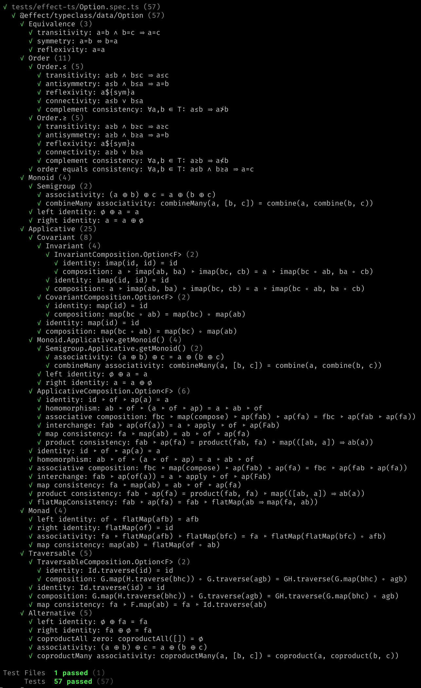
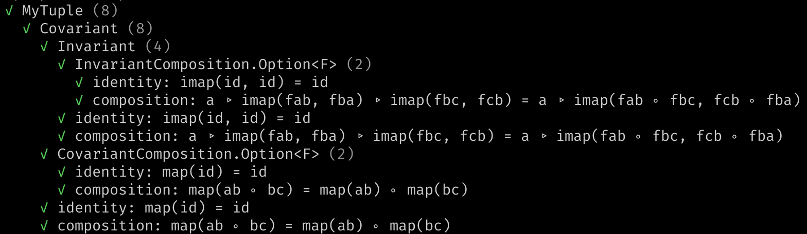

<h1 align='center' style='border: 0px !important'>⚖ effect-ts-laws</h1>

<h3 align='center' style='border: 0px !important'>
  Law Testing for
  <code style='color:#555'>effect-ts</code>
  Instances
</h3>

A library for testing [effect-ts](https://github.com/Effect-ts/effect)
typeclass laws using
[fast-check](https://github.com/dubzzz/fast-check). API is
[documented here](https://middle-ages.github.io/effect-ts-laws-docs/).

1. [About](#about)
   1. [Synopsis](#synopsis)
   2. [Overview](#overview)
2. [Project](#project)
   1. [Status](#status)
   2. [More Information](#more-information)
   3. [Open Questions](#open-questions)
   4. [Roadmap](#roadmap)
3. [See Also](#see-also)
   1. [Based On](#based-on)

## About

### Synopsis

Run the typeclass law tests on the `Order` and `Monad` instances of the
effect-ts `Option` datatype:

```ts
import {Monad} from '@effect/typeclass/data/Option'
import {Option} from 'effect'
import {Arbitrary, monoOrder, testTypeclassLaws} from 'effect-ts-laws'

describe('@effect/typeclass/data/Option', () => {
  testTypeclassLaws<OP.OptionTypeLambda>({
    getEquivalence: Option.getEquivalence,
    getArbitrary: Arbitrary.option},
  )({
    Order: Option.getOrder(monoOrder),
    Monad,
  })
})
```

_Vitest reporter_ shows test results for the `Option` datatype:

<a href="./docs/synopsis-option.png"></a>

---

<details><summary style='background:#f0f6ff;color:blue;cursor:pointer'>New datatype example.<span style='float: right'>👈 <i>click</i></span></summary>
<br/>

You wrote a new datatype: `MyTuple`, and an instance of the effect-ts
`Covariant` typeclass. Lets test it for free:

```ts
import {Covariant as CO, Invariant as IN} from '@effect/typeclass'
import {Array as AR} from 'effect'
import {dual} from 'effect/Function'
import {TypeLambda} from 'effect/HKT'
import fc from 'fast-check'
import {testTypeclassLaws} from 'effect-ts-laws'

describe('MyTuple', () => {
  type MyTuple<A> = [A]

  interface MyTupleTypeLambda extends TypeLambda {
    readonly type: MyTuple<this['Target']>
  }

  const map: CO.Covariant<MyTupleTypeLambda>['map'] = dual(
    2,
    <A, B>([a]: MyTuple<A>, ab: (a: A) => B): MyTuple<B> => [ab(a)],
  )

  // The instance we want to test
  const Covariant: CO.Covariant<MyTupleTypeLambda> = {
    map,
    imap: CO.imap<MyTupleTypeLambda>(map),
  }

  testTypeclassLaws<MyTupleTypeLambda>({
    getEquivalence: AR.getEquivalence,
    getArbitrary: fc.tuple},
  )({Invariant, Covariant})
})
```

`fast-check` will try to find a counter example that breaks the laws. If no such
example is found, you should see:



---

</details>

### Overview

Law testing is useful when you are building your own datatype and its
associated `effect-ts` instances. Law tests help you verify your instances are
lawful. This is a library of the `effect-ts` typeclass laws, and some law
testing infrastructure.

The implementation features:

* `effect-ts` datatype typeclass law tests. Because:
  * It could help `effect-ts`.
  * Serves as an excellent _self-test_ suite and as an example for testing your
    own instances.
  * See [status](#status) for details on what is ready.
* _Randomness_. Uses `fast-check` property testing. For
  _parameterized type_ typeclass laws, all functions are randomly generated as
  well.
* Minimal work to test instances for your own datatype: it can all be
  done with single function that takes the instances under test and
  a pair of functions: `getEquivalence` and `getArbitrary`.
  * Meaningful test coverage improvement for the price of writing two functions.
    You probably have them somewhere already.

API is [documented here](https://middle-ages.github.io/effect-ts-laws-docs/).

## Project

### Status

Matrix showing _data-types_ (in columns) vs. _typeclass law tests_ (in rows).
Each intersection of datatype and typeclass can be either:
**ready** (✅), **not ready** (❌), or **not relevant** (☐). First data row
show the _typeclass laws_ implementation status, and first data column shows
_datatype tests_ implementation status.

|                                                | Typeclass→ |     | [Equivalence](./src/laws/typeclass/concrete/Equivalence.ts) | [Order](./src/laws/typeclass/concrete/Order.ts) | [Semigroup](./src/laws/typeclass/concrete/Semigroup.ts) | [Monoid](./src/laws/typeclass/concrete/Monoid.ts) | [Invariant](./src/laws/typeclass/parameterized/Invariant.ts) | [Covariant](./src/laws/typeclass/parameterized/Covariant.ts) | [Applicative](./src/laws/typeclass/parameterized/Applicative.ts) | [Monad](./src/laws/typeclass/parameterized/Monad.ts) | [Traversable](./src/laws/typeclass/parameterized/Traversable.ts) |
| ---------------------------------------------- | ---------- | --- | ----------------------------------------------------------- | ----------------------------------------------- | ------------------------------------------------------- | ------------------------------------------------- | ------------------------------------------------------------ | ------------------------------------------------------------ | ---------------------------------------------------------------- | ---------------------------------------------------- | ---------------------------------------------------------------- |
|                                                |            |     | ✅                                                           | ✅                                               | ✅                                                       | ✅                                                 | ✅                                                            | ✅                                                            | ✅                                                                | ✅                                                    | ✅                                                                |
|                                                |            |     |                                                             |                                                 |                                                         |                                                   |                                                              |                                                              |                                                                  |                                                      |                                                                  |
| **↓Datatype**                                  |            |     |                                                             |                                                 |                                                         |                                                   |                                                              |                                                              |                                                                  |                                                      |                                                                  |
| [Boolean](./tests/effect-ts/Boolean.spec.ts)   | ✅          |     | ✅                                                           | ✅                                               | ✅                                                       | ✅                                                 | ☐                                                            | ☐                                                            | ☐                                                                | ☐                                                    | ☐                                                                |
| [Number](./tests/effect-ts/Number.spec.ts)     | ✅          |     | ✅                                                           | ✅                                               | ✅                                                       | ✅                                                 | ☐                                                            | ☐                                                            | ☐                                                                | ☐                                                    | ☐                                                                |
| [String](./tests/effect-ts/String.spec.ts)     | ✅          |     | ✅                                                           | ✅                                               | ✅                                                       | ✅                                                 | ☐                                                            | ☐                                                            | ☐                                                                | ☐                                                    | ☐                                                                |
| [BigInt](./tests/effect-ts/BigInt.spec.ts)     | ✅          |     | ✅                                                           | ✅                                               | ✅                                                       | ✅                                                 | ☐                                                            | ☐                                                            | ☐                                                                | ☐                                                    | ☐                                                                |
| [Duration](./tests/effect-ts/Duration.spec.ts) | ✅          |     | ✅                                                           | ✅                                               | ✅                                                       | ✅                                                 | ☐                                                            | ☐                                                            | ☐                                                                | ☐                                                    | ☐                                                                |
| [DateTime](./tests/effect-ts/DateTime.spec.ts) | ✅          |     | ✅                                                           | ✅                                               | ☐                                                       | ☐                                                 | ☐                                                            | ☐                                                            | ☐                                                                | ☐                                                    | ☐                                                                |
| [Identity](./tests/effect-ts/Identity.spec.ts) | ✅          |     | ☐                                                           | ☐                                               | ☐                                                       | ☐                                                 | ✅                                                            | ✅                                                            | ✅                                                                | ✅                                                    | ✅                                                                |
| [Option](./tests/effect-ts/Option.spec.ts)     | ✅          |     | ✅                                                           | ✅                                               | ✅                                                       | ✅                                                 | ✅                                                            | ✅                                                            | ✅                                                                | ✅                                                    | ✅                                                                |
| [Either](./tests/effect-ts/Either.spec.ts)     | ✅          |     | ✅                                                           | ☐                                               | ☐                                                       | ☐                                                 | ✅                                                            | ✅                                                            | ✅                                                                | ✅                                                    | ✅                                                                |
| [Array](./tests/effect-ts/Array.spec.ts)       | ✅          |     | ✅                                                           | ✅                                               | ✅                                                       | ✅                                                 | ✅                                                            | ✅                                                            | ✅                                                                | ✅                                                    | ✅                                                                |
| Struct                                         | ❌          |     | ❌                                                           | ❌                                               | ❌                                                       | ❌                                                 | ❌                                                            | ❌                                                            | ❌                                                                | ❌                                                    | ❌                                                                |
| Record                                         | ❌          |     | ❌                                                           | ❌                                               | ❌                                                       | ❌                                                 | ❌                                                            | ❌                                                            | ❌                                                                | ❌                                                    | ❌                                                                |
| Effect                                         | ❌          |     | ❌                                                           | ❌                                               | ❌                                                       | ❌                                                 | ❌                                                            | ❌                                                            | ❌                                                                | ❌                                                    | ❌                                                                |

### More Information

* [API documentation](https://middle-ages.github.io/effect-ts-laws-docs/).
* `README` at [the laws for typeclasses](src/laws/typeclass/concrete/README.md) on concrete types.
* `README` at [the laws for typeclasses](src/laws/typeclass/parameterized/README.md) on parameterized types.
* `README` at the typeclass laws [self-tests](tests/laws/typeclass/README.md).

### Open Questions

1. Rename to zio-style names? E.g.: `traverse` laws become `foreach` laws?
2. Match the typeclass graph of effect-ts more accurately? E.g.: split
   `Product` laws out of `Applicative`.

### Roadmap

* Tests
  * [ ] More typeclasses, more datatypes.
* Harness
  * [ ] Make it easier to test datatypes with multiple instances for same
        typeclass, for example `Option` and all its `Monoid`s.
  * [ ] Typeclass tests should not be all building the same helpers. They
        should be provided by the harness.
* Composition
  * [ ] Test composition flipped.
  * [ ] Compose arbitrary instances in composition tests.
  * [ ] Nest three levels.
* Arbitraries
  * [ ] Investigate arbitrary instances.
  * [ ] `oneof` arbitrary chosen from built-in instances.

## See Also

1. [fast-check](https://github.com/dubzzz/fast-check)
2. [effect-ts](https://github.com/Effect-ts/effect)
3. [zio-prelude](https://github.com/zio/zio-prelude/tree/series/2.x/laws/shared/src/main/scala/zio/prelude/laws) laws

### Based On

1. [fp-ts-laws](https://gcanti.github.io/fp-ts-laws) by
   [Giulio Canti](https://github.com/gcanti)
2. Scala's [Discipline](https://typelevel.org/cats/typeclasses/lawtesting.html)
