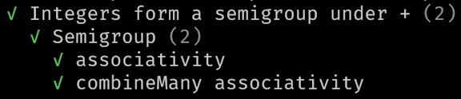
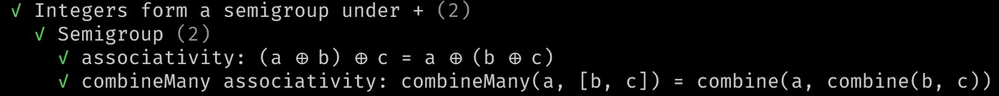
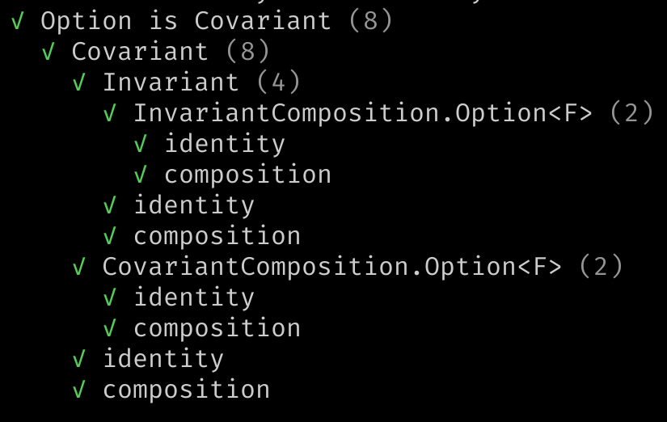
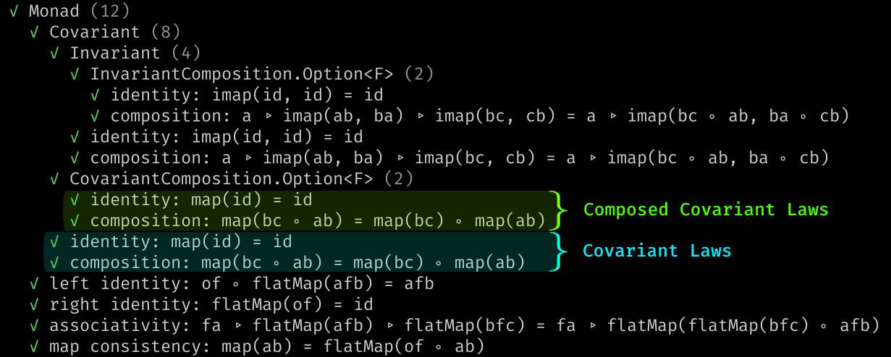

# User Guide

`effect-ts-laws` is a _law testing_ library. Read on for instructions on usage.
Most use-cases can skip the [Model](#model) section, and go directly from
[Import](#import) to [Usage](#usage).

1. [Overview](#overview)
   1. [Install](#install)
   2. [Import](#import)
2. [Model](#model)
   1. [Monomorphic](#monomorphic)
   2. [Extends Relation](#extends-relation)
   3. [Testing Laws on Composed Instances](#testing-laws-on-composed-instances)
   4. [Other Typeclass ↔ Typeclass Relations](#other-typeclass--typeclass-relations)
   5. [Deduplication](#deduplication)
   6. [Check vs. Test](#check-vs-test)
3. [Usage](#usage)
   1. [Testing Laws](#testing-laws)
      1. [Typeclass Laws For Concrete Types](#typeclass-laws-for-concrete-types)
      2. [Typeclass Laws For Parameterized Types](#typeclass-laws-for-parameterized-types)
      3. [Typeclass Law Testing API](#typeclass-law-testing-api)
      4. [Contravariant Typeclass Laws](#contravariant-typeclass-laws)
      5. [Schema Laws](#schema-laws)
      6. [Writing New Laws](#writing-new-laws)
      7. [Configure fast-check Runtime](#configure-fast-check-runtime)
   2. [Checking Laws](#checking-laws)
   3. [Arbitraries for effect-ts Datatypes and Functions of Higher-Kinded Types](#arbitraries-for-effect-ts-datatypes-and-functions-of-higher-kinded-types)

## Overview

### Install

To install, replace `pnpm` with your package manager:

```sh
# Peer dependencies:
pnpm i effect-ts @effect/typeclass

# Peer dev dependencies
pnpm i -D vitest fast-check @fast-check/vitest

# Install effect-ts-laws
pnpm i -D effect-ts-laws
```

### Import

```ts
import {LawSet, buildTypeclassLaws, ... } from 'effect-ts-laws'
import {testLawSets, ...} from 'effect-ts-laws/vitest'
import {Endo, Dual, ...} from 'effect-ts-laws/typeclass'
```

Every symbol can be imported from `effect-ts-laws` or
`effect-ts-laws/typeclass`, except functions related to law _testing_ with
vitest. These must be imported from `effect-ts-laws/vitest`.

`effect-ts-laws/typeclass` has some complementary code for [@effect/typeclass](https://github.com/Effect-TS/effect/tree/main/packages/typeclass), that may be useful for your law tests, but most of the functionality you will want can be imported from two entry points:

1. `effect-ts-laws` - Everything _not_ related to [vitest](https://vitest.dev).
2. `effect-ts-laws/vitest` - Vitest test runners.

Here is how you would _check_ a law, in this case a tautology, and then _test_
it:

```ts
import {Law, checkLaw, testLaw} from 'effect-ts-laws'
import {testLaw} from 'effect-ts-laws/vitest'
import {describe} from 'vitest'

const law: Law<[boolean]> = Law(
  'booleans are true or false',
  '∀a in boolean: a || !a', 
  fc.boolean(), 
)(a => a || !a)

// Checking
const maybeError: Option<string> = checkLaw(law)

// Testing
describe('law tests', ()  => {
  testLaw(law)
})
```

[The API module index](https://middle-ages.github.io/effect-ts-laws-docs/modules.html).
lists all exported symbols by module.

## Model

The only abstractions are `Law` and `LawSet`. The rest of the library
consists of:

1. Functions to build, relate, check, and test laws and sets of laws.
2. Arbitraries, utilities for [monomorphic](#monomorphic) testing, and other
   bits of law testing infrastructure.
3. Lots of tests: self-tests, tests of `effect-ts`, and some tests for `fast-check`.

A [Law](https://middle-ages.github.io/effect-ts-laws-docs/interfaces/law.Law.html) is a paper-thin wrapper of the `fast-check`
_property_, and a [LawSet](https://middle-ages.github.io/effect-ts-laws-docs/interfaces/law.LawSet.html)
is a recursive data structure composed of a set of laws and their dependencies
in the form of a list of LawSets. You can read about the
[Law here](https://middle-ages.github.io/effect-ts-laws-docs/interfaces/law.Law.html),
and the
[LawSet here](https://middle-ages.github.io/effect-ts-laws-docs/interfaces/law.LawSet.html).

The typeclass and schema laws are implemented as functions that build a
`LawSet` from a given instance/schema under test, together with a few
arbitraries/equivalences required by the specific `LawSet`.

For example the [Equivalence laws](https://github.com/middle-ages/effect-ts-laws/blob/main/src/laws/typeclass/concrete/Equivalence.ts)
are implemented as a function called `equivalenceLaws` which takes
[options of type ConcreteGiven](https://middle-ages.github.io/effect-ts-laws-docs/interfaces/laws.ConcreteGiven.html)
and returns a `LawSet` with the laws ready to be tested on the given instance
under test, taken from the key `F` of the given options.

You create a `Law` using a constructor called
[Law](https://middle-ages.github.io/effect-ts-laws-docs/functions/law.Law-1.html).

The `LawSet` constructor is also named after the type, but two more
constructors serve as syntax sugar for some common situations:

1. [LawSet](https://middle-ages.github.io/effect-ts-laws-docs/functions/law.LawSet-1.html)
   will build a `LawSet` from a list of required law sets, a name, and a list of laws.
2. [lawSet](https://middle-ages.github.io/effect-ts-laws-docs/functions/law.lawTests.html)
   is the same except it includes only a name and _laws_, and is not related to any
   other `LawSet`.
3. [lawSetTests](https://middle-ages.github.io/effect-ts-laws-docs/functions/law.lawSetTests.html)
   is also the same as the `LawSet` constructor except it takes only a list of `LawSet`
   to run with no laws, and is anonymous. Sets of laws with no name are merged with their
   sibling law tests and do not appear as a discrete named `describe` block in
   vitest results.

A few combinators are exported for building and filtering LawSets, for example
[addLaws](https://middle-ages.github.io/effect-ts-laws-docs/functions/law.addLaws.html).
Filtering can be useful, for example, if you need to remove a Law from LawSet, because
it is problematic for some datatype.

### Monomorphic

A law like
[Monad.associativity](https://github.com/middle-ages/effect-ts-laws/blob/main/src/laws/typeclass/parameterized/Monad.ts#L41),
is defined in such a way that every test can be run vs. _three_ distinct
_underlying_ types, given by the type parameters `A`, `B`, and `C`. The
_underlying_ types are the type parameters of typeclasses for parameterized
types. For example, the underlying type of `Option<number>` is `number`.

You can test the laws in this manner using functions like
[testParameterizedTypeclassLaws](https://middle-ages.github.io/effect-ts-laws-docs/functions/vitest.testTypeclassLaws.html)
if there are fault models, I.e.: ways in which your code can break, that require
this type of coverage.

However seeing as this is highly unlikely, adds considerable complexity to
the API, and imitating the _ancestors_ of this library from the Scala
and Haskell languages, the high-level typeclass law testing interface is
monomorphic, I.e.: `A`=`B`=`C`.

The single type we used for typeclass testing is `readonly number[]`. Thus when
testing the `Option` datatype, for example, the actual type used in the tests
will be `Option<Mono> ≡ Option<readonly number[]>`.

The
[monomorphic](https://github.com/middle-ages/effect-ts-laws/blob/main/src/laws/typeclass/monomorphic/helpers.ts)
module exports can be useful when working with this type.

### Extends Relation

If you map the `effect-ts` typeclass _extends_ relation, you will see they form
a directed acyclic graph. You can find a diagram of this graph
[below the target of this link](https://github.com/Effect-TS/effect/blob/main/packages/typeclass/README.md#concrete-types).

`effect-ts-laws` typeclass laws form a parallel graph. If typeclass `A` _extends_
typeclass `B`, then the laws of typeclass `A` require that the laws of typeclass
`B` pass as well. For example, running an instance through the `Covariant` laws
will also run it through the `Invariant` laws.

### Testing Laws on Composed Instances

Coverage for some fault models requires testing laws not just on the instance
under test, but also on the instance when _composed_ with another well-tested
instance.

For this reason, the typeclasses that can be _composed_ (_Applicative_,
_Covariant_, _Invariant_, _Traversable_, and _Foldable_), besides their
non-composed tests, are composed with an instance of the `Option` datatype and
run through the typeclass law tests yet again.

### Other Typeclass ↔ Typeclass Relations

Besides extension and composition, there are other relations between typeclasses
that need covering. These relations between _typeclasses_ are modelled as
relations between their _law tests_.

For example the type of the
[Applicative.getMonoid](https://github.com/Effect-TS/effect/blob/main/packages/typeclass/src/Applicative.ts#L28)
function is:

```ts
 <F extends TypeLambda>(
   F: Applicative<F>
 ) => <A, R, O, E>(M: Monoid<A>): Monoid<Kind<F, R, O, E, A>>
```

`getMonoid` gives you a Monoid for your datatype from a Monoid of your
underlying type. There are several fault models to cover here. Bugs
in the implementation of the datatype, for example, could lead to
a broken Monoid returned.

To cover this type of relation, the
[Applicative typeclass laws](https://github.com/middle-ages/effect-ts-laws/blob/main/src/laws/typeclass/parameterized/Applicative.ts#L34)
will build a Monoid using `Applicative.getMonoid` and run it through the
[Monoid typeclass laws](https://github.com/middle-ages/effect-ts-laws/blob/main/src/laws/typeclass/concrete/Monoid.ts).

In this example, the Monoid  laws are only run if a Monoid instance for the
underlying datatype has been found. Because the typeclass law tests are
[monomorphic](#monomorphic) and our underlying type is `readonly number[]`, we
always have a Monoid instance for the underlying type.

The Applicative laws are also related to the [Monad laws](https://github.com/middle-ages/effect-ts-laws/blob/main/src/laws/typeclass/parameterized/Monad.ts).
If given an instance of
[FlatMap](https://github.com/Effect-TS/effect/blob/main/packages/typeclass/src/FlatMap.ts)
for the datatype, an extra law will be tested: `flatMap consistency`.

There are many such relations, check the specific
[laws of a typeclass](https://github.com/middle-ages/effect-ts-laws/blob/main/src/laws/typeclass)
to see what laws are included and under what conditions.

### Deduplication

With typeclass laws requiring their dependencies pass, we could end up with
a single law being tested more than once on the same instance, after having
gotten there by different paths through the dependency graph.

For this reason laws are deduplicated before being run, so that only the minimal
required set of laws is run.

### Check vs. Test

_Checking_ a law means running it inside a pure function that will return a
possibly empty list of errors, with the empty list indicating the law has
been satisfied.

_Testing_ a law is the same thing, except run inside a _vitest_ test,
errors are reported as assert failure, and when the law is satisfied the test
will pass.

The separation lets us _check_ laws _outside_ of a vitest test and with no
vitest dependency.

[Look here](../dev/demo.ts) for a demo of a Node.js script that _checks_ the Effect Array datatype without involving Vitest.

## Usage

### Testing Laws

To create a law test you would:

1. Create a new `vitest` test file.
2. Build the required options. All builders of typeclass laws for example,
   require `getEquivalence` for a higher-kinded datatype.
3. Write code to build a
   [LawSet](https://middle-ages.github.io/effect-ts-laws-docs/interfaces/law.LawSet.html)
   from these requirements.
4. Test the laws via `checkLaws` or `testLaws`.

The specifics depend on the set of laws you are testing.

#### Typeclass Laws For Concrete Types

To build the `Equivalence`, `Order`, `Bounded`, `Semigroup` and `Monoid`
typeclass laws, all you need is:

1. The instance under test.
2. Equivalence for the datatype under test.
3. An Arbitrary for the datatype under test.

For example, to test the semigroup laws work for integer addition:

```ts
import {Semigroup as SE} from '@effect/typeclass'
import {Number as NU, pipe} from 'effect'
import {semigroupLaws} from 'effect-ts-laws'
import {testLaws} from 'effect-ts-laws/vitest'
import fc from 'fast-check'

describe('Integers form a semigroup under +', () => {
  const instance: SE.Semigroup<number> = {
    combine: NU.sum,
    combineMany: (head, rest) => NU.sumAll([head, ...rest]),
  }

  pipe(
    {F: instance, equalsA: NU.Equivalence, a: fc.nat()},
    semigroupLaws,
    testLaws,
  )
})
```

There are _two_ laws for
[Semigroup](https://github.com/middle-ages/effect-ts-laws/blob/main/src/laws/typeclass/concrete/Semigroup.ts),
and they are organized in named set of laws called `Semigroup`. Vitest will report the following results
when running this test:



If you replace the call to [testLaws](https://middle-ages.github.io/effect-ts-laws-docs/functions/vitest.testLaws.html)
with a call to [verboseLaws](https://middle-ages.github.io/effect-ts-laws-docs/functions/vitest.verboseLaws.html),
a variant of `testLaws` that automatically turns on the fast-check runtime `verbose`
parameter, you will get the same results but with the _notes_ shown:



#### Typeclass Laws For Parameterized Types

If your datatype is parameterized, as is for example the `Option` datatype, to build
laws you must provide:

1. The instance under test.
2. A function that will
   [lift equivalences](https://middle-ages.github.io/effect-ts-laws-docs/interfaces/law.LiftEquivalence.html)
   into your type.
3. The same but for
   [arbitraries](https://middle-ages.github.io/effect-ts-laws-docs/interfaces/arbitrary.LiftArbitrary.html).

For example the test the Covariant typeclass laws on the `Option` datatype:

```ts
import {covariantLaws, option, GivenConcerns, Mono} from 'effect-ts-laws'
import {testLaws} from 'effect-ts-laws/vitest'
import {pipe, Option as OP} from 'effect'
import {OptionTypeLambda} from 'effect/Option'
import {Covariant as optionCovariant} from '@effect/typeclass/data/Option'

describe('Option is Covariant', () => {
  const given: GivenConcerns<OptionTypeLambda, Mono> =
    unfoldMonomorphicGiven<OptionTypeLambda>({
      getEquivalence: OP.getEquivalence,
      getArbitrary: option,
    })

  pipe(
    {F: optionCovariant, ...given},
    covariantLaws<OptionTypeLambda, Mono>,
    testLaws,
  )
})

```

Vitest will show the test results so:



#### Typeclass Law Testing API

Because this distinction between typeclasses for _concrete_ vs. _parameterized_ types does not help when defining
law tests as described above, and because you usually have several instances of
several typeclasses for a single datatype, you may prefer to use the high-level
unified API for testing typeclass laws that lets you test several instances of a
single datatype in single function call. This is how the `effect-ts`
[datatype tests](https://github.com/middle-ages/effect-ts-laws/tree/main/tests/effect-ts)
are defined.

[testTypeclassLaws](https://middle-ages.github.io/effect-ts-laws-docs/functions/vitest.testTypeclassLaws.html)
is the high-level interface for testing typeclass laws.

You provide the instances under test keyed by their typeclass, a _getArbitrary_
and a _getEquivalence_ for the datatype under test, and it will unfold these two
humble functions into the typeclass law options, build the correct typeclass
laws, and then test them.

Here for example we run some _concrete_ and _parameterized_ typeclass laws on
the `Option` datatype. Note how instances under test are keyed by their
typeclass name.

```ts
import {
  getOptionalMonoid,
  Monad,
  Traversable,
} from '@effect/typeclass/data/Option'
import {Option as OP} from 'effect'
import {monoEquivalence, monoOrder, monoSemigroup, option} from 'effect-ts-laws'
import {testTypeclassLaws} from 'effect-ts-laws/vitest'
import {OptionTypeLambda} from 'effect/Option'

describe('option', () => {
  testTypeclassLaws<OptionTypeLambda>({
    // The required options for building typeclass laws.
    getEquivalence: OP.getEquivalence,
    getArbitrary: option,
  })({
    // Struct of of instances under test, key is typeclass name. 
    Equivalence: OP.getEquivalence(monoEquivalence),
    Order: OP.getOrder(monoOrder),
    Monoid: getOptionalMonoid(monoSemigroup),
    Monad,
    Traversable,
  })
})
```

Every instance of the _five_ we provided gets its own typeclass laws tests.
Vitest will show _five_ typeclass law sets tested, one per instance.

Some typeclass laws _extend_ others, so for example the `Covariant` typeclass
laws are tested as part of the `Monad` typeclass law tests. Some typeclasses
are _composable_, so for example the `Covariant` typeclass law tests are run
once by themselves, and once again when composed inside of an `Option`:



#### Contravariant Typeclass Laws

🚧

#### Schema Laws

🚧

#### Writing New Laws

🚧

#### Configure fast-check Runtime

You may want to pass parameters to `fast-check` because:

1. A test is too slow, and you wish to reduce `numRuns`, or you wish to increase
   `numRuns` to increase coverage
2. You have a `seed` and `path` from a failed run and would   like to debug this
   counterexample directly.
3. You want to use `fast-check` reporting.

These `fast-check` parameters, [documented
here](https://fast-check.dev/api-reference/interfaces/Parameters.html), can be
configured for law testing at three levels, listed by priority from highest to
lowest:

1. **Per check or per test** by providing the optional `parameters` argument to
   the `check/test` functions. This will override the global and `Law`
   configuration.
2. **Per law** values of the type
   [Law](https://middle-ages.github.io/effect-ts-laws-docs/interfaces/law.Law.html)
   carry an optional field `parameters`. The constructor
   [Law](https://middle-ages.github.io/effect-ts-laws-docs/functions/law.Law-1.html)
   will take a `parameters` argument as an optional argument following the
   _predicate_. Useful for example, to reduce `numRuns` in the definition of a law
   that is slow to test. This will override global configuration.
3. **Global test setup** in a `vitest.setup.ts` file, as
   [described here](https://fast-check.dev/docs/configuration/global-settings/#vitest).

Parameters configured at the `Law` lever override global configuration, and parameters
provided at the top level calls to check/test functions override both.

`check*` functions, like `checkLaws`, will ignore the vitest global
configuration as it is active only at test-time.

The [schema laws self-test](https://github.com/middle-ages/effect-ts-laws/blob/main/tests/laws/schema.spec.ts)
_bad decoder_ test, for example, creates a counterexample in a single run using
the **Per check or per test** mechanism described above and a seed + path
recorded from the results of some other test:

```ts
// We expect the counterexample to fail
const errors = checkLaws(schemaLaws(Person), {
  numRuns: 1,
  seed: -1512491049,
  path: '38',
})
```

### Checking Laws

_Checking_ laws is exactly like _testing_ laws, except your code does not have
to depend on the testing library `vitest`. Useful when you want to use this
library from code that is not test code, for example _monitoring_ code.

You can check laws using the functions
[checkLaws](https://middle-ages.github.io/effect-ts-laws-docs/functions/law.checkLaws.html), or
[checkLawSets](https://middle-ages.github.io/effect-ts-laws-docs/functions/law.checkLawSets.html),
imported from `effect-ts-laws`. These functions return a possibly empty list of
string errors. If the list is empty, then the laws are satisfied, or more
accurately, we failed in finding a counterexample.

[checkLaw](https://middle-ages.github.io/effect-ts-laws-docs/functions/law.checkLaw.html)
will check a single law and return an option of a string that will be `none` if
the law is satisfied, or `some` error message otherwise.

[asAssert](https://middle-ages.github.io/effect-ts-laws-docs/functions/law.asAssert.html)
is a lower level interface that returns the law in the form of a `fast-check` property
wrapped in a `fast-check` assert for you to do with as you please.

Note importing `effect-ts-laws/vitest` behaves just like importing `vitest`, in
the sense that code being run from _outside_ test code will immediately croak
complaining that:

> <code style="background:#a00;color:#fff">Vitest failed to access its internal state.</code>.

### Arbitraries for effect-ts Datatypes and Functions of Higher-Kinded Types

You can find out more about the `arbitrary`
[module here](https://github.com/middle-ages/effect-ts-laws/blob/main/src/arbitrary/README.md).
You will find there:

1. Arbitraries for some basic `effect-ts` datatypes like `Option` and `Either`.
2. Arbitraries for some basic `effect-ts` temporal datatypes like `Duration` and
   `OffsetTimezone`.
3. Arbitraries of the function types required for law testing typeclasses like
   [Applicative](https://github.com/middle-ages/effect-ts-laws/blob/main/src/laws/typeclass/parameterized/Applicative.ts),
   for example an arbitrary for functions of the type
   `(a: A) => F<B, Out1, Out2, In1>`.
4. `Monad` and `Equivalence` (based on sampling) instances for the `fast-check`
   _Arbitrary_ type.
