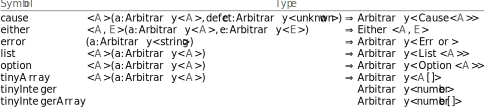

# `arbitrary`

`fast-check` utilities and arbitraries for `effect-ts` datatypes.

1. [Importing](#importing)
2. [Modules](#modules)
   1. [monad](#monad)
   2. [data](#data)
   3. [time](#time)
   4. [function](#function)
   5. [effect](#effect)

## Importing

Every type and function below can be imported directly from
`effect-ts-laws/arbitrary`.

<details><summary>Example</summary>

---

Importing arbitraries from this package:

```ts
import {Option as OP, pipe} from 'effect'
import {tinyArray, tinyInteger, option} from 'effect-ts-laws/arbitrary'
import fc from 'fast-check'

const arbitrary: fc.Arbitrary<OP.Option<number>[]> = pipe(
  tinyInteger,
  option,
  tinyArray
)
```

</details>

## Modules

### [monad](https://github.com/middle-ages/effect-ts-laws/tree/main/src/arbitrary/monad.ts)

[Monad](https://github.com/Effect-TS/effect/blob/main/packages/typeclass/src/Monad.ts)
instance for the [fast-check](https://fast-check.dev/) `Arbitrary` type, and a
[type lambda](https://effect.website/docs/other/behaviour/hkt#type-lambdas) for
the type.

There is also an
[Equivalence](https://github.com/Effect-TS/effect/blob/main/packages/effect/src/Equivalence.ts)
instance which will try to find counter-examples to the equivalence and return
true if none found.

<details><summary>Example</summary>

---
Using the `flatMap` function:

```ts
import {Effect as EF, flow, pipe} from 'effect'
import {Monad} from 'effect-ts-laws/arbitrary'
import fc from 'fast-check'

const greaterThanOne = (i: number): EF.Effect<string, Error> =>
  i > 1 ? EF.succeed('OK') : EF.fail(new Error('KO'))

const oneThirdFail: fc.Arbitrary<EF.Effect<string, Error>> = pipe(
  fc.integer({min: 1, max: 3}),
  Monad.flatMap(flow(greaterThanOne, fc.constant)),
)
```

</details>


### [data](https://github.com/middle-ages/effect-ts-laws/blob/main/src/arbitrary/data.ts)

Arbitraries for some basic `effect-ts` datatypes.



### [time](https://github.com/middle-ages/effect-ts-laws/blob/main/src/arbitrary/time.ts)

Arbitraries for `effect-ts` temporal types.


### [function](https://github.com/middle-ages/effect-ts-laws/blob/main/src/arbitrary/function.ts)

Function arbitraries.


### [effect](https://github.com/middle-ages/effect-ts-laws/blob/main/src/arbitrary/effect.ts)

Arbitraries for the `Effect` type.


