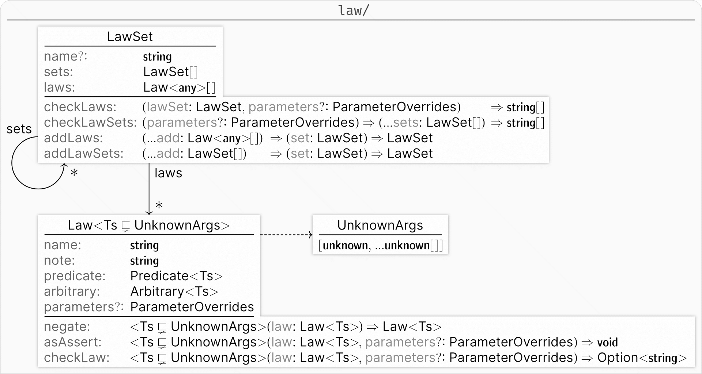

# Law

The basic abstractions of `effect-ts-laws` are `Law` and `LawSet`.

A [`Law`](law.ts) is a paper-thin wrapper of the
[fast-check
_property_](https://fast-check.dev/docs/core-blocks/properties/#introduction),
and a [`LawSet`](lawSet.ts) is a recursive data structure composed of a list of
`Law` and their dependencies encoded in a list of `LawSet`.

## Import

Everything exported here can be directly imported from `effect-ts-laws`.

```ts
import {Law, negateLaw} from 'effect-ts-laws'
// Law and negateLaw are in scope
```

## Usage

```ts
import {checkLaw, Law, negateLaw} from 'effect-ts-laws'
const law: Law<[number, number]> = Law(
  'sum of positives is greater or equal to both',
  '∀n₁,n₂ ∈ ℕ, sum=n₁+n₂: sum ≥ n₁ ∧ sum ≥ n₂',
  tinyPositive,
  tinyPositive,
)((x, y) => x + y >= x && x + y >= y)
const lawSet: LawSet = lawTests('sums', lawA, ...otherLaws)
```

## Types


